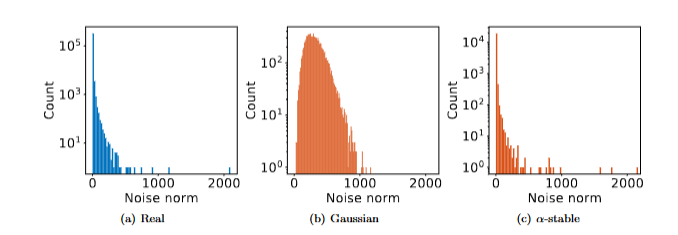
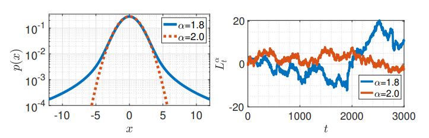

## Handoff From the Previous Talks

The previous talks gave us two models:

- Brownian motion: continuous paths, Gaussian increments, finite variance.
- SDE model for SGD: minibatch noise perturbs gradient flow.

This paper asks:

> What if the stochastic gradient noise is not close to Gaussian?

The answer proposed by Simsekli, Sagun, and Gurbuzbalaban is:

- model gradient noise with an $\alpha$-stable law;
- model continuous-time SGD with a Levy-driven SDE;
- use jump-process metastability to explain a preference for wide minima.

## The SGD Object Being Modeled

We minimize an empirical risk

$$
f(w) = \frac{1}{n}\sum_{i=1}^n f^{(i)}(w),
\qquad
w^\star = \arg\min_{w \in \mathbb{R}^p} f(w).
$$

SGD uses a minibatch $\Omega_k$ of size $b$:

$$
w_{k+1}
= w_k - \eta \nabla \widetilde f_k(w_k),
\qquad
\nabla \widetilde f_k(w)
= \frac{1}{b}\sum_{i \in \Omega_k}\nabla f^{(i)}(w).
$$

Define stochastic gradient noise

$$
U_k(w) = \nabla \widetilde f_k(w) - \nabla f(w).
$$

Everything in the paper depends on how we model $U_k(w)$.

## Brownian Baseline

The standard modeling assumption is

$$
U_k(w) \sim \mathcal{N}(0,\sigma^2 I).
$$

Then the SGD update can be written as

$$
w_{k+1}
= w_k - \eta \nabla f(w_k)
+ \sqrt{\eta}\sqrt{\eta\sigma^2}\, Z_k,
\qquad
Z_k \sim \mathcal{N}(0,I).
$$

For small $\eta$, this suggests the SDE

$$
dw_t = -\nabla f(w_t)\,dt + \sqrt{\eta\sigma^2}\,dB_t.
$$

This is Langevin-type dynamics driven by Brownian motion.

## Why the Paper Challenges This Baseline

The Gaussian/Brownian picture has two tensions.

1. Empirical tension: measured gradient noise in deep nets has much heavier tails than Gaussian noise.

2. Theoretical tension: Brownian paths are continuous, so escaping a basin usually means climbing the barrier.

For Brownian-driven small-noise dynamics, first exit times scale roughly like

$$
\exp\!\left(\frac{2H}{\varepsilon^2}\right),
$$

where $H$ is a relevant barrier height.

That makes depth more important than width, which clashes with the folklore that SGD tends to prefer wide minima.

## Gradient Noise Is Not Gaussian

## Stable Laws: The Replacement for Gaussian Noise

The generalized central limit theorem says:

- finite variance sums $\Rightarrow$ Gaussian limit;
- heavy-tailed sums with infinite variance $\Rightarrow$ $\alpha$-stable limit.

The paper focuses on symmetric $\alpha$-stable random variables:

$$
X \sim S\alpha S(\sigma)
\quad \Longleftrightarrow \quad
\mathbb{E}e^{i\omega X}
= \exp(-|\sigma\omega|^\alpha).
$$

Key facts:

- $\alpha \in (0,2]$ is the tail index;
- smaller $\alpha$ means heavier tails;
- $\mathbb{E}|X|^r < \infty$ if and only if $r < \alpha$;
- $\alpha=2$ recovers a Gaussian: $S2S(\sigma)=\mathcal{N}(0,2\sigma^2)$.

## Proof Sketch: Why Stable Laws Replace Gaussians

The intuitive proof is the same story as the CLT, but with different scaling.

For Gaussian CLT:

$$
\frac{X_1+\cdots+X_m}{m^{1/2}}
\Rightarrow \text{Gaussian}.
$$

For heavy-tailed variables with tail index $\alpha$:

$$
\frac{X_1+\cdots+X_m}{m^{1/\alpha}}
\Rightarrow S\alpha S.
$$

The scaling exponent changes from $1/2$ to $1/\alpha$ because rare large terms dominate the sum.

That is the mathematical door from Brownian motion to Levy motion.

## From Stable Noise to a Levy-Driven SDE

The paper assumes each coordinate of the gradient noise is stable:

$$
[U_k(w)]_i \sim S\alpha S(\sigma(w)).
$$

Then SGD can be rewritten as

$$
w_{k+1}
= w_k - \eta \nabla f(w_k)
+ \eta^{1/\alpha}\left(\eta^{(\alpha-1)/\alpha}\sigma\right)S_k,
$$

where each coordinate of $S_k$ has law $S\alpha S(1)$.

For small $\eta$, the continuous-time model becomes

$$
dw_t
= -\nabla f(w_t)\,dt
+ \eta^{(\alpha-1)/\alpha}\sigma\,dL_t^\alpha.
$$

Here $L_t^\alpha$ is an $\alpha$-stable Levy motion.

## Definition of $\alpha$-Stable Levy Motion

In the vector SDE above, each coordinate of $L_t^\alpha$ is an independent scalar $\alpha$-stable Levy motion on $\mathbb{R}$. For $\alpha \in (0,2]$, such a scalar process is determined by:

- **(i)** $L_0^\alpha = 0$ almost surely.
- **(ii)** For $t_0 < t_1 < \cdots < t_N$, the increments $L_{t_i}^\alpha - L_{t_{i-1}}^\alpha$ are independent ($i = 1,\ldots,N$).
- **(iii)** For $s < t$, the increment $L_t^\alpha - L_s^\alpha$ has the same law as $L_{t-s}^\alpha$, namely $S\alpha S\big((t-s)^{1/\alpha}\big)$.
- **(iv)** Stochastic continuity: for every $\delta > 0$ and $s \ge 0$, $\mathbb{P}\big(|L_t^\alpha - L_s^\alpha| > \delta\big) \to 0$ as $t \to s$.

When $\alpha = 2$, $L_t^\alpha$ agrees with $\sqrt{2}\,B_t$ for standard Brownian motion $B_t$.

## Brownian Motion vs. Levy Motion

| Feature | Brownian motion $B_t$ | Stable Levy motion $L_t^\alpha$ |
|---|---|---|
| Increment law | Gaussian | $\alpha$-stable |
| Tail behavior | light-tailed | heavy-tailed for $\alpha<2$ |
| Variance | finite | infinite for $\alpha<2$ |
| Paths | almost surely continuous | can have jumps |
| Basin escape | climb out | jump out |

The crucial behavioral change is discontinuity: large jumps make barrier height less controlling. $\alpha=2$ gives scaled Brownian motion.

## Stable Densities and Levy Paths

<em>Figure 2: Left - $\mathrm{S}\alpha\mathrm{S}$ densities; right - sample paths of $L_t^{\alpha}$ for $p=1$. For $\alpha < 2$, the density has heavier tails and $L_t^{\alpha}$ displays jumps.</em>

## Metastability Setup

To isolate the basin-escape mechanism, the paper studies the 1D small-noise SDE:

\small
$$
dw_t^\varepsilon
= -\nabla f(w_t^\varepsilon)\,dt
+ \varepsilon\,dL_t^\alpha.
$$
\normalsize

Assume $f$ has local minima $m_1,\dots,m_r$ separated by local maxima

\small
$$
-\infty=s_0<m_1<s_1<\cdots<s_{r-1}<m_r<s_r=\infty.
$$
\normalsize

Each valley:

\small
$$
S_i = (s_{i-1},s_i), \qquad L_i = |s_i-s_{i-1}|.
$$
\normalsize

\textbf{Question:} Starting near $m_i$, how long until the process reaches another basin?

## Theorem 1: Levy Exit Times

For $w_0$ near $m_i$, as $\varepsilon \to 0$, transition times satisfy

$$
\mathbb{P}_{w_0}(\varepsilon^\alpha T^i(\varepsilon)\ge u)
\le e^{-q_i u}.
$$

The transition probabilities are controlled by

$$
q_{ij}
= \frac{1}{\alpha}
\left|
\frac{1}{|s_{j-1}-m_i|^\alpha}
- \frac{1}{|s_j-m_i|^\alpha}
\right|,
\qquad
q_i=\sum_{j\ne i}q_{ij}.
$$

Interpretation:

- transition time is polynomial in noise scale, on the order of $\varepsilon^{-\alpha}$;
- the rates depend on distances to valley boundaries;
- basin height does not appear.

## Intuition for Theorem 1

The full proof uses small-noise metastability theory for Levy processes, but the mechanism is understandable.

For Brownian motion:

- paths are continuous;
- to leave a valley, the process must pass through the boundary;
- the barrier height strongly controls the escape time.

For Levy motion:

- paths can make large jumps;
- escape happens when one jump is large enough to clear the distance to the boundary;
- the probability of such a jump is governed by the power-law tail.

That is why width appears through distances, while height disappears from the leading-order formula.

## Theorem 2: A Markov Chain Over Minima

After rescaling time by $\varepsilon^{-\alpha}$, the Levy-driven process converges to a continuous-time Markov chain on the minima:

\small
$$
w_{t\varepsilon^{-\alpha}}^\varepsilon
\Rightarrow
Y_{m_i}(t), \qquad Y(t)\in\{m_1,\dots,m_r\}.
$$

The generator has off-diagonal entries

\small
$$
q_{ij}
= \frac{1}{\alpha}
\left|
\frac{1}{|s_{j-1}-m_i|^\alpha}
- \frac{1}{|s_j-m_i|^\alpha}
\right|,
$$

and diagonal entries

\small
$$
q_{ii} = -\sum_{j\ne i}q_{ij}.
$$

The stationary probabilities solve

\small
$$
Q^T\pi=0.
$$

## Wide Valleys in the Two-Minima Case

For two minima with $m_1<0<m_2$ and the barrier at $s_1=0$, the paper gives

$$
\pi_1
= \frac{|m_1|^\alpha}{|m_1|^\alpha+m_2^\alpha},
\qquad
\pi_2
= \frac{m_2^\alpha}{|m_1|^\alpha+m_2^\alpha}.
$$

So if $m_2>|m_1|$, the second valley is wider and

$$
\pi_2>\pi_1,
\qquad
\frac{\pi_2}{\pi_1}
=\left(\frac{m_2}{|m_1|}\right)^\alpha.
$$

This is the cleanest theoretical connection:

> If SGD noise is $\alpha$-stable, Levy metastability predicts more time in wider valleys.

## Two Valleys

\begin{figure}
\centering
\includegraphics[height=0.56\textheight,keepaspectratio]{www/image3.png}
\caption{An objective with two local minima $m_1$, $m_2$ separated by a local maximum at $s_1 = 0$.}
\end{figure}

## Estimating the Tail Index

The paper uses an estimator specialized for stable laws.

Let $X_1,\dots,X_K \sim S\alpha S(\sigma)$ and $K=K_1K_2$. Define block sums

$$
Y_i=\sum_{j=1}^{K_1}X_{j+(i-1)K_1},
\qquad i=1,\dots,K_2.
$$

The estimator is

$$
\widehat{\frac{1}{\alpha}}
=
\frac{1}{\log K_1}
\left(
\frac{1}{K_2}\sum_{i=1}^{K_2}\log |Y_i|
-
\frac{1}{K}\sum_{i=1}^K \log |X_i|
\right).
$$

Then $\widehat{1/\alpha}\to 1/\alpha$ almost surely as $K_2\to\infty$.

## Proof Sketch: Why the Estimator Works

\small
Stable laws scale under summation:

$$
X_1 + \cdots + X_{K_1} \sim S\alpha S(K_1^{1/\alpha}\sigma).
$$

Taking logs of absolute values, the block sum looks like

$$
\log |Y_i|
\approx
\log |X_i| + \frac{1}{\alpha}\log K_1.
$$

So the average log-magnitude gap is approximately

$$
\frac{1}{\alpha}\log K_1.
$$

Divide by $\log K_1$, and you estimate $1/\alpha$.

This proof idea is accessible because it uses the defining scaling property of stable laws.  

## Tail Estimator  

\begin{figure}
\centering
\includegraphics[height=0.56\textheight,keepaspectratio]{www/image4.png}
\caption{Tail-index estimator illustration.}
\end{figure}

## Experimental Protocol

At selected SGD iterations, the authors:

1. compute the full gradient $\nabla f(w_k)$;
2. partition the data into disjoint minibatches of size $b$;
3. compute minibatch gradients $\nabla \widetilde f_{\Omega_k^i}(w_k)$;
4. form gradient noises

$$
U_k^i(w_k)
= \nabla \widetilde f_{\Omega_k^i}(w_k)-\nabla f(w_k);
$$

5. concatenate coordinates and estimate $\alpha$.

Experiments vary:

- architecture: fully connected nets and AlexNet-like CNNs;
- dataset: MNIST, CIFAR10, CIFAR100;
- network size, minibatch size, loss function, and random seed.

## Results: Network Size - FCN Width and Depth

\begin{figure}
\centering
\includegraphics[height=0.56\textheight,keepaspectratio]{www/image5.png}
\caption{Estimation of $\alpha$ for varying widths and depths in FCNs. The curves in the left figures correspond to different depths, and the ones on the right figures correspond to widths.}
\end{figure}

## Results: Network Size - CNN Width

\begin{figure}
\centering
\includegraphics[height=0.56\textheight,keepaspectratio]{www/image6.png}
\caption{The accuracy and $\widehat{\alpha}$ of the CNN for varying widths.}
\end{figure}

## Results: Minibatch Size

\begin{figure}
\centering
\includegraphics[height=0.56\textheight,keepaspectratio]{www/image7.png}
\caption{Estimation of $\alpha$ for varying minibatch size.}
\end{figure}

## Results: Evolution During Training

\begin{figure}
\centering
\includegraphics[height=0.56\textheight,keepaspectratio]{www/image8.png}
\caption{The iteration-wise behavior of $\alpha$ for the FCN.}
\end{figure}

Observed pattern:

- early phase: $\alpha$ rapidly decreases;
- near minimum $\alpha$: the SGD trajectory shows a jump-like event;
- later phase: $\alpha$ stabilizes while accuracy improves.

The authors interpret this as evidence that early SGD dynamics may include barrier crossing or large basin transitions.

They do not prove whether the jump lands in a different basin or a better part of the same basin.

## Brownian Results vs. Levy Results

| Question | Brownian model | Levy model |
|---|---|---|
| Noise law | Gaussian | $\alpha$-stable |
| CLT justification | finite variance CLT | generalized CLT |
| Continuous-time driver | $B_t$ | $L_t^\alpha$ |
| Path geometry | continuous | jumps for $\alpha<2$ |
| Escape scaling | exponential in barrier height | polynomial in $\varepsilon^{-1}$ |
| What controls preference? | depth/barrier height dominates | width appears directly |
| Wide minima story | hard to explain locally | supported by metastability |

## What Is Proven vs. What Is Inferred

Proven or cited mathematical facts:

- stable laws arise from a generalized CLT;
- stable Levy motion has $\alpha$-stable increments;
- Levy-driven small-noise dynamics has width-dependent transition rates;
- in simple cases, stationary probabilities favor wider valleys.

Empirical evidence:

- measured gradient noise in deep nets is heavy-tailed;
- estimated $\alpha$ is consistently below $2$;
- minibatch size does not restore Gaussianity in their experiments.

Inference:

> If SGD gradient noise is well modeled as $\alpha$-stable, then existing Levy metastability theory gives a plausible mechanism for SGD's preference for wide minima.

## Limitations and Open Problems

The paper is careful about what remains open.

- The metastability theory is continuous-time; SGD is discrete.
- The dependence on learning rate and minibatch size is not fully characterized.
- The tail index may change with the current state $w_k$ and time.
- Deep-network landscapes have many nearly flat directions, while the clean theory assumes nondegenerate minima.
- Empirical heavy tails do not by themselves prove that an exact stable law governs every coordinate.

These are not minor details, but they are also useful directions for future theory.

## Closing Summary

The paper's argument has a clear chain:

$$
\text{heavy-tailed gradient noise}
\Rightarrow
\alpha\text{-stable model}
\Rightarrow
\text{Levy-driven SDE}
\Rightarrow
\text{jumps}
\Rightarrow
\text{width-dependent metastability}.
$$

Compared with Brownian motion:

- Brownian SGD noise explains diffusion around minima;
- Levy SGD noise explains rare large jumps between regions;
- the Levy model gives a cleaner local mechanism for why wide minima can be preferred.

Final takeaway:

> The tail index $\alpha$ is not just a distributional statistic; in this framework, it controls the geometry of SGD's exploration.
