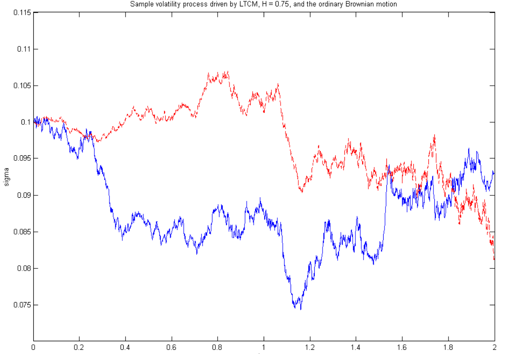
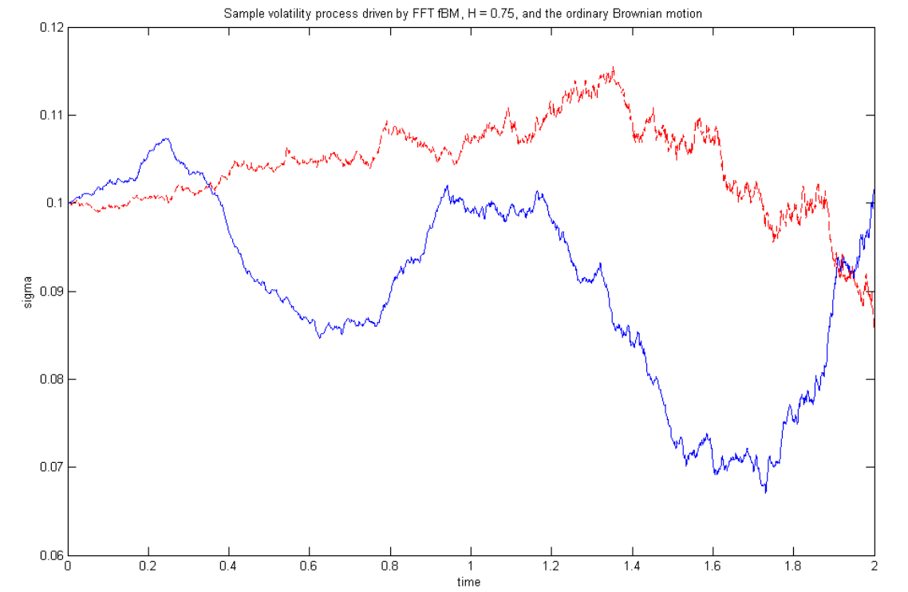

# Outline

1. Motivating Fractional Brownian Motion
2. Methods of Simulating
3. Finance example (time permitting)

---

# Why Fractional Brownian Motion?

---

<div style="font-size: 80%;">
**The Problem:** Traditional stochastic volatility models can't capture volatility persistence  

- Implied volatility smile decays too quickly (geometric decay)  

- Market data shows much slower decay (hyperbolic) - called **long-range dependence**  

- Need a process that retains Gaussian structure but exhibits memory  


**The Solution:** Use Fractional Brownian Motion (fBM) with Hurst exponent $H$  

- Extends ordinary Brownian motion to capture long memory  

- When $H > 0.5$: persistent (trending) behavior  

- When $H < 0.5$: mean-reverting behavior (anti-persistent, "rougher" than BM)  

</div>

---

# Volatility Surface

---

```{=html}
<video width="800" height="500" controls preload="auto" style="margin-top: 20px;">
  <source src="/www/vol_surface.mp4" type="video/mp4">
  Your browser does not support the video tag.
</video>
```

---

# From Random Walks to Brownian Motion

---

## Random Walk

Start with a simple symmetric random walk:

$$S_n = \sum_{i=1}^{n} X_i, \quad X_i \sim \begin{cases} 1 & \frac{1}{2}\\ -1 & \frac{1}{2}\end{cases}\\
B(t) = \frac{1}{\sqrt{N}} S_{[Nt]}$$

As $N \to \infty$, by Central Limit Theorem: $B(t) \xrightarrow{d} \text{Standard Brownian Motion}$, i.e. Brownian motion is the **scaling limit** of a simple random walk.

---

- $B(0) = 0$
- Increments are independent: $B(t) - B(s) \perp B(s)$ for $t > s$
- Variance: $\text{Var}(B(t)) = t$
- Self-similar: $B(\lambda t) \xrightarrow{d} \sqrt{\lambda} B(t)$

---

## Correlated Random Walk


$$S_n^H = \sum_{i=1}^{n} X_i^H$$

where $X_i^H$ are **dependent**, not independent

**Autocorrelation structure:**
$$
\gamma_H(k) = \mathbb{E}[X_1^H \cdot X_{1+k}^H] = \frac{1}{2}[(k+1)^{2H} + (k-1)^{2H} - 2k^{2H}]\\
B^H(t) = \frac{1}{N^H} S_{[Nt]}^H
$$

---

As $N \to \infty$: $B^H(t) \xrightarrow{d} \text{Fractional Brownian Motion with Hurst exponent } H$

**Key difference:**
- $H = 0.5$: Standard BM (no correlation)
- $H > 0.5$: **Persistent** - positive correlation in increments
- $H < 0.5$: **Mean-reverting** - negative correlation in increments

---

# Definition: Fractional Brownian Motion

---

A Fractional Brownian Motion $B_H(t)$ with Hurst exponent $H \in (0,1)$ is a **continuous, centered Gaussian process** with covariance:

$$\mathbb{E}[B_H(t) B_H(s)] = \frac{1}{2}(t^{2H} + s^{2H} - |t-s|^{2H})$$  

**Covariance of increments:**
$$\text{Cov}(X_i, X_j) = \gamma_H(|i-j|) \sim H(2H-1)|i-j|^{2H-2} \text{ as } |i-j| \to \infty$$


--- 

**Key Properties:**  

1. **Self-similarity**: $B_H(\lambda t) \xrightarrow{d} \lambda^H B_H(t)$  

2. **Stationary increments**: $B_H(t+s) - B_H(s) \xrightarrow{d} B_H(t)$  

3. **Gaussian structure**: Maintains tractability  

4. **Variance scaling**: $\text{Var}(B_H(t)) = t^{2H}$  

5. **Long-range dependence** (only when $H > 0.5$)


---

<div style="display: flex; flex-direction: column; align-items: center; justify-content: center; height: 70%;">
  
  <figcaption style="text-align: center; font-size: 0.9em;">
    Blackout - Dan Holdsworth (2010)
  </figcaption>
</div>

---

# Challenges in Analytical Pricing

---

<div style="font-size: 0.8em;">

1. **Not a semimartingale** (except when $H = 0.5$)
   - Standard Ito calculus doesn't apply
   - Need Malliavin calculus for rigorous analysis
   - Analytical pricing formulas don't exist

2. **Need to validate models** via Monte Carlo
   - Estimate long-memory parameters
   - Calibrate to market data
   - Test option pricing formulas

3. **Practical requirement:** Generate sample paths for:
   - Risk simulations
   - Volatility persistence studies
   - Model estimation and validation

</div>

---

# Simulating fBM for $H > 0.5$ (persistent/long-memory case)

---

# Method 1: Hosking Algorithm

---

**Idea:** sequentially sample $Z_{n+1}$ given $Z_{0:n}$. Build fBM by summation.

<div style="font-size: 60%;">

Autocovariance $\gamma(k)$, Toeplitz block
$$
\Gamma^{(n)}=\{\gamma(i-j)\}_{i,j=0}^{n},\quad
\Gamma^{(n+1)}=\begin{pmatrix}1 & c^{(n)\!\top}\\ c^{(n)} & \Gamma^{(n)}\end{pmatrix},
\quad c^{(n)}_k=\gamma(k+1).
$$

Conditional Gaussian:
$$
\mu_{n+1}=\mathbb E[Z_{n+1}\!\mid\! Z_{0:n}]=c^{(n)\!\top}(\Gamma^{(n)})^{-1} Z_{0:n},
\qquad
\sigma_{n+1}^2=\mathrm{Var}(Z_{n+1}\!\mid\! Z_{0:n})=1-c^{(n)\!\top}(\Gamma^{(n)})^{-1}c^{(n)}.
$$

Dieker/Hosking recursions:
$$
d^{(n)}=(\Gamma^{(n)})^{-1}c^{(n)},\quad
\Gamma^{(n+1)^{-1}}=\frac{1}{\sigma_n^2}
\begin{pmatrix}
\sigma_n^2\Gamma^{(n)^{-1}}+F^{(n)}d^{(n)}d^{(n)\!\top}F^{(n)} & -F^{(n)}d^{(n)}\\[2pt]
-d^{(n)\!\top}F^{(n)} & 1
\end{pmatrix},
$$
with
$$
\sigma_{n+1}^2=\sigma_n^2-\frac{\big(\gamma(n+1)-\tau_{n}\big)^2}{\sigma_n^2},\quad
\tau_n=d^{(n)\!\top}F^{(n)}c^{(n)},\quad
\phi_n=\frac{\gamma(n+2)-\tau_n}{\sigma_n^2},\quad
d^{(n+1)}=\begin{pmatrix} d^{(n)}-\phi_n F^{(n)}d^{(n)} \\ \phi_n \end{pmatrix}.
$$

**Intuition:** condition on the past. Update inverse covariance cheaply instead of reinverting.

**Cost:** $O(N^2)$ time

</div>

---

## Algorithm {.smaller}

**Input:** Desired sample size $N$, Hurst exponent $H$

**Setup:**  

- Compute autocovariance: $\gamma(k) = \frac{1}{2}[(k+1)^{2H} + (k-1)^{2H} - 2k^{2H}]$  

- Build covariance matrix: $\Gamma^{(n)} = \{\gamma(|i-j|)\}_{i,j=0}^{n}$  


**Recursion (for $n = 0, 1, \ldots, N-1$):**  

1. Compute conditional mean: $\mu_{n+1} = \mathbf{c}^{(n)'} (\Gamma^{(n)})^{-1} \mathbf{Z}_{1:n}$  

2. Compute conditional variance: $\sigma_{n+1}^2 = 1 - \mathbf{c}^{(n)'} (\Gamma^{(n)})^{-1} \mathbf{c}^{(n)}$  

3. Sample: $Z_{n+1} \sim N(\mu_{n+1}, \sigma_{n+1}^2)$  

4. Accumulate: $B_H(n+1) = \sum_{i=1}^{n+1} Z_i$  

---

<div style="font-size: 80%;">

- Exact method: captures complete covariance structure  
- Works for any covariance structure (not just fBM)

### Key Flaw: Computational Complexity
- **Time complexity:** $O(N^2)$  
  - Must invert $N \times N$ matrix at each step  
  - Becomes prohibitive for large $N$ (e.g., $N > 10,000$)

### Optimization (Dieker, 2002):  
Recursively compute inverse without full recalculation: improves constant factor but still $O(N^2)$

**Conclusion:** Best for small to moderate sample sizes ($N < 5000$)

</div>

---

# Method 2: Cholesky Decomposition

## Overview

**Idea:** Use matrix decomposition $\Gamma = LL'$ where $L$ is lower triangular

Sample generation: $\mathbf{Z} = L \mathbf{V}$ where $\mathbf{V} \sim N(0, I)$

Covariance structure preserved: $\text{Cov}(\mathbf{Z}) = L L' = \Gamma$

---

<div style="font-size: 70%;">

## Algorithm

**Input:** Desired sample size $N$, Hurst exponent $H$

**Setup:**
- Build covariance matrix: $\Gamma^{(N)}$ with entries $\Gamma_{i,j} = \gamma(|i-j|)$

**Decomposition:**  

1. Compute Cholesky decomposition: $\Gamma^{(N)} = L L'$  

2. Generate $\mathbf{V} \sim N(0, I_N)$ (i.i.d. standard normals)  

3. Multiply: $\mathbf{Z} = L\mathbf{V}$  

4. Accumulate: $B_H(t) = \sum_{i=1}^t Z_i$  


**Entry formulas for $L$:**
$$L_{i,i}^2 = \gamma(0) - \sum_{k=0}^{i-1} L_{i,k}^2$$
$$L_{i,j} = \frac{1}{L_{j,j}}\left(\gamma(i-j) - \sum_{k=0}^{j-1} L_{i,k} L_{j,k}\right)$$

</div>

---

- Exact method: complete covariance structure  

- Easy to understand and implement  


- **Time complexity:** $O(N^3)$  

  - Cholesky decomposition itself is $O(N^3)$ (Much worse than Hosking!)  

---

# FFT Method Algorithm (Davies-Harte Method) {.smaller}

---

Any circulant matrix can be decomposed as:
$$C = QAQ^T$$

where the Fourier matrix $Q$ has entries:

$$(Q)_{j,k} = \frac{1}{\sqrt{2N}} \exp\left(2\pi i \frac{jk}{2N}\right) \quad \text{for } j, k = 0, \ldots, 2N-1 \quad \quad (25)$$

The matrix $\Lambda$ is the diagonal matrix with eigenvalues:

$$\lambda_k = \sum_{j=0}^{2N-1} c_{0,j} \exp\left(2\pi i \frac{jk}{2N}\right) \quad \text{for } j, k = 0, \ldots, 2N-1 \quad \quad (26)$$

---

<div style="font-size: 40%;">


**Algorithm:** The simulation of the sample path of fGn using the FFT method consists of the following steps:

1. **Compute eigenvalues** $\{\lambda_k\}_{k=0,\ldots,2N-1}$ from the circulant covariance matrix by means of FFT. This will reduce the computational time from $O(N^3)$ to $O(N \log N)$.

2. **Calculate** $Q = Q^T$ (or $Q = \sqrt{\Lambda}$ where $\Lambda$ is diagonal with eigenvalues)

3. **Generate** two standard normal random variables: $W_0 = V_0^{(1)}$ and $W_N = V_N^{(1)}$

4. **For** $1 \leq j < N$, generate two standard normal random variables $V_j^{(1)}$ and $V_j^{(2)}$ and let:
   $$W_j = \frac{1}{\sqrt{2}}\left(V_j^{(1)} + i V_j^{(2)}\right)$$
   $$W_{2N-j} = \frac{1}{\sqrt{2}}\left(V_j^{(1)} - i V_j^{(2)}\right)$$

5. **Compute** $Z = QA^{1/2}W$. This can be seen as another Fourier transform of the vector $A^{1/2}W$:
   $$Z_j = \frac{1}{\sqrt{2N}} \sum_{k=0}^{2N-1} \sqrt{\lambda_k} W_k \exp\left(-2\pi i \frac{jk}{2N}\right)$$

6. **It is identical to carry out FFT** on the following sequence:
   $$w_j = \begin{cases}
   \sqrt{\lambda_0^{(1)}} \cdot 0 \\
   \sqrt{\frac{\lambda_j^{(1)} + i\lambda_j^{(2)}}{2}} (V_j^{(1)} + i V_j^{(2)}) & j = 1, \ldots, N-1 \\
   \sqrt{\frac{\lambda_N^{(1)}}{2N}} & j = N \\
   \sqrt{\frac{\lambda_j^{(1)} - i\lambda_j^{(2)}}{2}} (V_{2N-j}^{(1)} - i V_{2N-j}^{(2)}) & j = N+1, \ldots, 2N-1
   \end{cases}$$

7. Due to the symmetric nature of the sequence, the Fourier sum of $\{w_j\}_{j=0}^{2N-1}$ is real. The first $N$ samples have the desired covariance structure. Since the second half of samples $(N, \ldots, 2N-1)$ are not independent of the first $N$ samples, this sample cannot be used.

$$B_H(t) = \sum_{i =1}^t Z_i$$$$

</div>

---

<div style="font-size: 60%;">
- Exploits circulant structure via FFT (divide-and-conquer)

- Diagonal matrix multiplication is $O(M)$

- FFT itself is $O(M \log M)$

- Embedding creates artificial circulant structure

  - Original covariance not perfectly preserved at boundaries

  - Must check all eigenvalues $\hat{\Lambda}_k > 0$ for stability

- **Fix:** Increase $M$ (use larger $M = 4N$ or more) to fix negative eigenvalues

  - Increases memory and computation


### Advantages over Hosking & Cholesky:
- **Time:** $O(N \log N)$ instead of $O(N^2)$ or $O(N^3)$

- Fast for large $N$ (practical for $N > 10,000$)


**Conclusion:** Trade-off: slight covariance distortion, but gain massive speed

</div>

---

# Approximate Methods

---

# Method 4: Correlated Random Walk 

---

**Recall:** fBM is limit of scaled correlated random walk:
$$B^H(t) = N^{-H} \sum_{i=1}^{[Nt]} \epsilon_i^H$$

**Idea:** Use **finite aggregation** with controlled error

Generate correlated increments directly using central limit theorem

---

## Algorithm {.smaller}

**Input:** Sample size $N$, Hurst exponent $H$, error tolerance $\epsilon_{tol}$

**Step 1: Determine aggregation level**
- Compute $M(N)$ from error bound: $\epsilon \leq 0.65 D_H N^{1-H} / kM$
- Choose $k \leq 1$ and solve for $M$

**Step 2: Generate $M$ correlated sequences**
For each trajectory $j = 1, \ldots, M$:
- Sample $U_k \sim \text{Uniform}(0,1)$ (i.i.d.)
- Compute weight: $\mu_k^{(H)} = (1 - U_k)^{1/(2-2H)}$

**Step 3: Build correlated random walk**
For each time $t_i$:
- Generate correlated sequence: $\epsilon_i = (-1)^{\text{Bernoulli}} \times \mu_i$
- Accumulate: $X_t = \sum_{i=1}^t \epsilon_i$

**Step 4: Scale and accumulate**
$$B_H(t) \approx c_H' \frac{\sum_{j=1}^M X_j^{(\mu_j)}}{M}$$


---

<div style="font-size: 80%;">

- Explicit error bound from **Berry-Esseen inequality**: for sum of i.i.d. variables $S_n$,  
  $$
  \sup_x \left|P\left(\frac{S_n - \mathbb{E}S_n}{\sqrt{\mathrm{Var}\,S_n}} \leq x\right) - \Phi(x)\right| \leq \frac{C \cdot \mathbb{E}|X_i|^3}{\left(\mathrm{Var}\,X_i\right)^{3/2} \sqrt{n}}
  $$
  where $C$ is a constant ($\leq 0.4748$), and $\Phi(x)$ is the standard normal cdf.

- Simple to implement: no matrix operations needed


- Covariance **not fully captured** at each level  

- Slow for large $N$  

- Requires choosing parameters $(M, k)$ based on tolerance  


**Best for:** Theoretical understanding, small-to-moderate $N$, when error control matters

</div>


---

# Method 5: Random Midpoint Displacement (RMD)

---

**Hybrid approach:** Exact locally, but with bounded conditioning

**Idea:** Instead of conditioning on **all past values**, condition on only **$m$ left + $n$ right neighbors**

**Intuition:** Far-away values have little influence, exploit locality

----

<div style="font-size: 60%;">


## Algorithm - Basic RMD(m,n) {.smaller}

**Input:** Sample size $N$, Hurst exponent $H$, parameters $m, n$ (neighborhood sizes)

**Bisection scheme (recursive):**  

1. Start with $Z(0) = 0, Z(1) \sim N(0, 1)$  

2. At level $i$, compute midpoints in $2^i$ intervals  

3. For position $X_{i, 2k+1}$ (odd-indexed in interval $2k$):

$$X_{i,2k+1} = \mu(i,k) + \sigma(i,k) U_{i,k}$$

where:  

- $\mu(i,k)$ = conditional mean on neighboring values  

- $\sigma^2(i,k)$ = conditional variance   

- Neighbors: max($2k-m+1, 1$) to $2k$ (left) and $k+1$ to min($k+n, 2^{i-1}$) (right)  


**Matrix inversion for conditional distribution:**
$$\mu(i,k) = \Gamma_{12} \Gamma_{22}^{-1} \mathbf{X}_{\text{neighbors}}\\
\sigma^2(i,k) = \Gamma_{11} - \Gamma_{12} \Gamma_{22}^{-1} \Gamma_{21}$$

</div>


---

<div style="font-size: 60%;">

- $O(m+n)$ matrix inversion per step, not $O(N)$  

- Can generate indefinitely without fixed horizon  


- Truncates far dependencies  

  - When $m, n$ are small: ignores some correlations

  - Need to tune $(m, n)$ based on $H$

  - Loss of long-range dependence near boundaries


- On-the-fly version adds complexity
  - Algorithm has to manage "enlargement" (doubling time horizon)

  - Order of generation matters (bisection vs on-the-fly)

  - Harder to implement than FFT

- **Streaming:** Generate one path point at a time (on-the-fly variant)

- **Accuracy:** Near-exact when $m, n$ are large enough

- **Adaptive:** Can adjust parameters based on tolerance


**Best for:** Streaming applications, when horizon is unknown


**Comparison:** On-the-fly RMD vs FFT offer similar speed ($O(N)$ vs $O(N\log N)$), but RMD more flexible

</div>

---

# Method 6: Spectral Method

## Overview

**Idea:** Transform to frequency domain using spectral density of fGn

Spectral density of fractional Gaussian noise:
$$f(\lambda) = 2\sin(\pi H)\Gamma(2H+1)(1-\cos\lambda)|\lambda|^{-2H-1} + B(\lambda, H)$$

where $B(\lambda, H)$ corrects for periodicity effects (complex expression)

## Algorithm Outline {.smaller}

**Input:** Sample size $N$, Hurst exponent $H$

**Step 1: Approximate spectral density**
- Compute $f(\lambda_k)$ for frequencies $\lambda_k = \pi k / l$, $k = 0, \ldots, l$
- Use Paxson's robust approximation for $B(\lambda, H)$

**Step 2: Frequency-domain sampling**
Generate coefficients:
$$a_k = \begin{cases}
0 & k=0 \\
R_k \sqrt{f(t_k)} \exp(i\Phi_k) & k=1, \ldots, N/2-1 \\
U_{N/2}\sqrt{f(t_{N/2})} & k=N/2 \\
a_k^* & k=N/2+1, \ldots, N-1
\end{cases}$$

where $R_k \sim \text{Exp}(1)$, $\Phi_k \sim \text{Uniform}(0, 2\pi)$ (independent)

**Step 3: Inverse FFT**
$$\mathbf{Z} = \text{IFFT}(\mathbf{a})$$

$$B_H(t) = \sum Z_i$$

---

<div style="font-size: 60%;">
- **Spectral representation theorem:** fGn can be reconstructed from spectral density
- $O(N\log N)$
- Approximates covariance structure well

- Exact form of $B(\lambda, H)$ unknown
  - Paxson's approximation: empirical + calibrated
    - For $|\lambda| > 0$, 
      $$B(\lambda, H) \approx -2 \sin(\pi H)\Gamma(2H+1)\left(\frac{1-\cos \lambda}{|\lambda|^{2H+1}}\right)$$  

    - For computational purposes, set $f(\lambda) \approx 2\sin(\pi H)\Gamma(2H+1)(1-\cos\lambda)|\lambda|^{-2H-1}$
  - Depends on correct parameterization

- Only one FFT needed (vs two for Davies-Harte)
  - ~4x faster than Davies-Harte FFT
  - But requires careful implementation

- Empirically validated for wide range of $H$  


**Best for:** Large-scale simulations where speed is critical
</div>

---

# Comparison

---

<div style="font-size: 60%;">
| Method | Type | Time | Accuracy | Flexibility | Best For |
|--------|------|------|----------|-------------|----------|
| **Hosking** | Exact | $O(N^2)$ | Exact | Fixed horizon | $N < 5K$, when exact needed |
| **Cholesky** | Exact | $O(N^3)$ | Exact | Fixed horizon | $N < 1K$, small samples |
| **FFT (CEM)** | Near-exact | $O(N\log N)$ | Near-exact | Fixed horizon | $N > 5K$, standard choice |
| **Corr. RW** | Approx | $O(N^{2-2H})$ | Controlled error | On-the-fly | Theory, error control |
| **RMD** | Near-exact | $O(N)$ | Bounded error | Streaming | Unknown horizon |
| **Spectral** | Approx | $O(N\log N)$ | Good approx | Fixed horizon | Largest $N$, speed critical |

</div>

---

```{r}
#| context: setup

library(magick)

# ===================================================================
# fBM SIMULATION METHODS IMPLEMENTATION
# ===================================================================
# This section implements all 6 methods for simulating Fractional Brownian Motion:
# 
# 1. HOSKING ALGORITHM: Sequential conditioning on past values
#    - Time: O(N²), Space: O(N²)
#    - Best for: Small samples (N < 5,000)
#    - Exact method capturing full covariance
#
# 2. CHOLESKY DECOMPOSITION: Direct matrix factorization
#    - Time: O(N³), Space: O(N²)
#    - Best for: Small samples (N < 1,000)
#    - Simplest and most intuitive exact method
#
# 3. FFT (CIRCULANT EMBEDDING): Circulant matrix via FFT
#    - Time: O(N log N), Space: O(N)
#    - Best for: Large samples (N > 5,000)
#    - Industry standard; near-exact with boundary corrections
#
# 4. CORRELATED RANDOM WALK: Aggregation-based approximation
#    - Time: O(N^{2-2H}), Space: O(N)
#    - Best for: Theory, error control, streaming
#    - Approximates covariance asymptotically
#
# 5. RANDOM MIDPOINT DISPLACEMENT: Bisection with local conditioning
#    - Time: O(N), Space: O(1) worst-case
#    - Best for: Streaming/unknown horizon
#    - Exact conditioning on local neighborhood
#
# 6. SPECTRAL METHOD: Frequency-domain approximation via FFT
#    - Time: O(N log N), Space: O(N)
#    - Best for: Very large N, speed critical
#    - ~4x faster than FFT with Paxson's spectral density approx
# ===================================================================


generate_fbm_hosking <- function(n, H) {
  # Compute autocovariance
  gamma <- function(k) {
    if (k == 0) return(1)
    0.5 * (abs(k + 1)^(2*H) - 2*abs(k)^(2*H) + abs(k - 1)^(2*H))
  }
  
  Z <- numeric(n)
  Z[1] <- rnorm(1)
  
  if (n == 1) return(cumsum(Z))
  
  # Build covariance matrix incrementally
  cov_matrix <- matrix(0, n, n)
  cov_matrix[1, 1] <- 1
  
  for (i in 1:(n-1)) {
    # Build i x i covariance matrix
    for (j in 1:i) {
      for (k in 1:i) {
        cov_matrix[j, k] <- gamma(abs(j - k))
      }
    }
    
    # Conditional mean and variance
    c_vec <- sapply(1:i, function(k) gamma(k + 1))
    
    cov_inv <- tryCatch(
      solve(cov_matrix[1:i, 1:i]),
      error = function(e) solve(cov_matrix[1:i, 1:i] + diag(1e-8, i))
    )
    
    mu <- as.numeric(crossprod(c_vec, cov_inv %*% Z[1:i]))
    sigma2 <- 1 - as.numeric(crossprod(c_vec, cov_inv %*% c_vec))
    sigma2 <- max(sigma2, 1e-8)
    
    Z[i + 1] <- mu + sqrt(sigma2) * rnorm(1)
  }
  
  cumsum(Z)
}

# ===================================================================
# METHOD 2: CHOLESKY DECOMPOSITION
# ===================================================================
generate_fbm_cholesky <- function(n, H) {
  # Create covariance matrix
  cov_matrix <- matrix(0, n, n)
  for (i in 1:n) {
    for (j in 1:n) {
      cov_matrix[i, j] <- 0.5 * (abs(i - j + 1)^(2*H) - 
                                  2*abs(i - j)^(2*H) + 
                                  abs(i - j - 1)^(2*H))
    }
  }
  
  # Cholesky decomposition
  L <- tryCatch(
    chol(cov_matrix),
    error = function(e) {
      chol(cov_matrix + diag(1e-6, n))
    }
  )
  
  # Generate standard normal increments
  Z <- rnorm(n)
  
  # Generate FBM
  fbm <- crossprod(L, Z)
  cumsum(as.vector(fbm))
}

# ===================================================================
# METHOD 3: FFT (CIRCULANT EMBEDDING METHOD)
# ===================================================================
generate_fbm_fft <- function(n, H) {
  gamma <- function(k) {
    if (k == 0) return(1)
    0.5 * (abs(k + 1)^(2*H) - 2*abs(k)^(2*H) + abs(k - 1)^(2*H))
  }
  
  # Extend to power of 2
  M <- 2^ceiling(log2(2*n))
  
  # Build circulant covariance
  circ_cov <- c(sapply(0:(n-1), gamma), rep(0, M - n))
  circ_cov[(M-n+1):M] <- sapply((n-1):1, gamma)
  
  # FFT of first row
  lambda <- Re(fft(circ_cov))
  
  # Ensure positive (adjust if needed)
  if (any(lambda < -1e-10)) {
    M <- 2 * M
    circ_cov <- c(sapply(0:(n-1), gamma), rep(0, M - n))
    circ_cov[(M-n+1):M] <- sapply((n-1):1, gamma)
    lambda <- Re(fft(circ_cov))
  }
  
  # Take square root
  sqrt_lambda <- sqrt(pmax(lambda, 0))
  
  # Generate samples
  U <- rnorm(M)
  U_fft <- fft(U)
  Z_fft <- sqrt_lambda * U_fft
  Z <- Re(fft(Z_fft, inverse = TRUE)) / M
  
  cumsum(Z[1:n])
}

# ===================================================================
# METHOD 4: CORRELATED RANDOM WALK (Approximate)
# ===================================================================
generate_fbm_crw <- function(n, H, M = NULL) {
  if (is.null(M)) {
    # Heuristic for aggregation level
    M <- max(2, floor(sqrt(n / (1 - H))))
  }
  
  # Generate M correlated sequences
  X <- matrix(0, n, M)
  
  for (j in 1:M) {
    # Generate uniform random variables
    U <- runif(n)
    
    # Transform to get correlated increments
    mu_vec <- (1 - U)^(1 / (2 - 2*H))
    
    # Apply sign randomness
    signs <- sample(c(-1, 1), n, replace = TRUE)
    X[, j] <- cumsum(signs * mu_vec)
  }
  
  # Average and scale
  c_H <- sqrt(pi * H / sin(pi * H)) * 2^H
  fbm_approx <- c_H * rowMeans(X)
  
  fbm_approx
}

# ===================================================================
# METHOD 5: RANDOM MIDPOINT DISPLACEMENT (RMD)
# ===================================================================
generate_fbm_rmd <- function(n, H, m = 10, n_neighbors = 10) {
  gamma <- function(k) {
    if (k == 0) return(1)
    0.5 * (abs(k + 1)^(2*H) - 2*abs(k)^(2*H) + abs(k - 1)^(2*H))
  }
  
  # Bisection-based approach
  result <- numeric(n)
  result[1] <- 0
  
  if (n == 1) return(result)
  
  result[n] <- rnorm(1)
  
  # Recursive bisection
  bisect_fill <- function(left, right, result) {
    if (right - left < 2) return(result)
    
    mid <- (left + right) %/% 2
    
    # Determine neighbors
    n_left <- min(n_neighbors, mid - left)
    n_right <- min(n_neighbors, right - mid)
    
    left_idx <- max(left, mid - n_left)
    right_idx <- min(right, mid + n_right)
    
    neighbor_idx <- c(left_idx:(mid-1), (mid+1):right_idx)
    neighbor_vals <- result[neighbor_idx]
    
    if (length(neighbor_idx) > 0) {
      neighbor_distances <- abs(neighbor_idx - mid)
      
      # Build covariance
      cov_mat <- matrix(0, length(neighbor_idx) + 1, length(neighbor_idx) + 1)
      for (i in 1:(length(neighbor_idx)+1)) {
        for (j in 1:(length(neighbor_idx)+1)) {
          if (i == length(neighbor_idx) + 1 & j == length(neighbor_idx) + 1) {
            cov_mat[i, j] <- 1
          } else if (i == length(neighbor_idx) + 1 | j == length(neighbor_idx) + 1) {
            idx <- if (i == length(neighbor_idx) + 1) j else i
            cov_mat[i, j] <- gamma(abs(neighbor_idx[idx] - mid))
          } else {
            cov_mat[i, j] <- gamma(abs(neighbor_idx[i] - neighbor_idx[j]))
          }
        }
      }
      
      # Condition on neighbors
      cov_inv <- tryCatch(
        solve(cov_mat[-nrow(cov_mat), -ncol(cov_mat)]),
        error = function(e) diag(1e-8, nrow(cov_mat) - 1)
      )
      
      mu <- as.numeric(cov_mat[nrow(cov_mat), -ncol(cov_mat)] %*% cov_inv %*% neighbor_vals)
      sigma2 <- 1 - as.numeric(cov_mat[nrow(cov_mat), -ncol(cov_mat)] %*% cov_inv %*% 
                               cov_mat[-nrow(cov_mat), ncol(cov_mat)])
      sigma2 <- max(sigma2, 1e-8)
      
      result[mid] <- mu + sqrt(sigma2) * rnorm(1)
    } else {
      result[mid] <- rnorm(1)
    }
    
    result <- bisect_fill(left, mid, result)
    result <- bisect_fill(mid, right, result)
    result
  }
  
  result <- bisect_fill(1, n, result)
  cumsum(result)
}

# ===================================================================
# METHOD 6: SPECTRAL METHOD (Fast FFT approximation)
# ===================================================================
generate_fbm_spectral <- function(n, H) {
  # Extended to power of 2
  N <- 2^ceiling(log2(n))
  
  # Spectral density approximation for fGn
  spectral_density <- function(lambda, H) {
    if (lambda == 0) return(1)
    # Paxson's approximation
    term1 <- 2 * sin(pi * H) * gamma(2*H + 1) * (1 - cos(lambda)) * abs(lambda)^(-2*H - 1)
    term2 <- abs(lambda)^(1 - 2*H) * (1 - cos(lambda))
    max(term1 + term2, 0)
  }
  
  # Compute spectral density at Fourier frequencies
  freqs <- 2 * pi * (0:(N-1)) / N
  spec <- sapply(freqs, function(f) spectral_density(f, H))
  spec <- pmax(spec, 0)
  
  # Generate coefficients
  a <- complex(N)
  for (k in 1:(N-1)) {
    a[k] <- sqrt(spec[k] / N) * (rnorm(1) + 1i * rnorm(1)) / sqrt(2)
  }
  a[1] <- sqrt(spec[1] / N) * rnorm(1)
  
  # Enforce symmetry for real output
  for (k in 2:(N/2)) {
    a[N - k + 2] <- Conj(a[k])
  }
  
  # Inverse FFT
  Z <- Re(fft(a, inverse = TRUE)) / sqrt(N/2)
  
  cumsum(Z[1:n])
}

# Wrapper function to select method
generate_fbm <- function(n, H, method = "cholesky") {
  method <- tolower(method)
  
  switch(method,
    "hosking" = generate_fbm_hosking(n, H),
    "cholesky" = generate_fbm_cholesky(n, H),
    "fft" = generate_fbm_fft(n, H),
    "crw" = generate_fbm_crw(n, H),
    "rmd" = generate_fbm_rmd(n, H),
    "spectral" = generate_fbm_spectral(n, H),
    generate_fbm_cholesky(n, H)  # Default to Cholesky
  )
}

# Function to create animation frames
create_animation_frames <- function(path, H, n_steps, method = "cholesky") {
  frames <- list()
  
  frame_skip <- max(1, floor(n_steps / 100))
  frame_indices <- seq(1, n_steps, by = frame_skip)
  
  for (idx in seq_along(frame_indices)) {
    step <- frame_indices[idx]
    
    temp_file <- tempfile(fileext = ".png")
    
    png(temp_file, width = 700, height = 500, res = 100)
    
    plot(
      1:n_steps,
      path,
      type = "n",
      lwd = 2.5,
      col = "#2E86AB",
      xlab = "Time",
      ylab = "Position",
      main = paste0("fBM Simulation: H = ", round(H, 2), 
                    " | ", method, " | Step: ", step, "/", n_steps),
      cex.main = 1.5,
      cex.lab = 1.2
    )
    
    grid(nx = 20, ny = 20, col = "lightgray", lty = 2)
    
    if (step > 0) {
      lines(1:step, path[1:step], lwd = 2.5, col = "#2E86AB")
      points(step, path[step], col = "#E74C3C", cex = 1.5, pch = 16)
    }
    
    if (H > 0.55) {
      interpretation <- "Persistent (Trending)"
      text_col <- "#A23B72"
    } else if (H < 0.45) {
      interpretation <- "Mean-Reverting"
      text_col <- "#F18F01"
    } else {
      interpretation <- "Standard BM"
      text_col <- "#C73E1D"
    }
    
    mtext(interpretation, side = 3, line = -1.5, col = text_col, font = 2, cex = 1.2)
    
    dev.off()
    frames[[idx]] <- image_read(temp_file)
    unlink(temp_file)
  }
  
  animation <- do.call(c, frames)
  animation <- image_animate(animation, fps = 10, loop = 1)
  
  return(animation)
}
```

```{r}
#| context: server

anim_state <- reactiveValues(
  animation = NULL,
  H = 0.5,
  n_steps = 500,
  method = "cholesky"
)

observeEvent(input$resample, {
  H <- input$hurst
  n <- input$n_steps
  method <- input$method
  
  path <- generate_fbm(n, H, method)
  anim_state$animation <- create_animation_frames(path, H, n, method)
  anim_state$H <- H
  anim_state$n_steps <- n
  anim_state$method <- method
})

output$simulation_plot <- renderImage({
  if (is.null(anim_state$animation)) {
    temp_file <- tempfile(fileext = ".png")
    png(temp_file, width = 700, height = 500)
    plot(0, type = "n", axes = FALSE, xlab = "", ylab = "")
    text(0.5, 0.5, "Click 'Generate New Sample' to see animation", 
         cex = 1.5, col = "gray60")
    dev.off()
    
    list(src = temp_file, contentType = "image/png", width = "100%", height = "450px")
  } else {
    temp_file <- tempfile(fileext = ".gif")
    image_write(anim_state$animation, path = temp_file)
    
    list(src = temp_file, contentType = "image/gif", width = "100%", height = "450px", deleteFile = TRUE)
  }
}, deleteFile = FALSE)
```

## Try Different Hurst Values

::: {style="display: flex; gap: 20px; align-items: flex-start;"}

::: {style="flex: 0 0 25%; background-color: #f0f0f0; padding: 15px; border-radius: 5px;"}

```{r}
# Add CSS styling for compact controls
tags$style(HTML("
  .compact-controls .form-group {
    margin-bottom: 12px;
  }
  .compact-controls .form-group label {
    font-size: 13px;
    margin-bottom: 4px;
  }
  .compact-controls select {
    font-size: 12px;
    padding: 4px 6px;
  }
  .compact-controls input[type='slider'] {
    font-size: 12px;
  }
  .compact-controls .shiny-input-container {
    font-size: 12px;
  }
"))

tags$div(class = "compact-controls",
  selectInput(
    "method",
    strong("Simulation Method:"),
    choices = list(
      "Cholesky (Exact, O(N³))" = "cholesky",
      "Hosking (Exact, O(N²))" = "hosking",
      "FFT (Near-exact, O(N log N))" = "fft",
      "Spectral (Approx, O(N log N))" = "spectral",
      "Corr. Random Walk (Approx, fast)" = "crw",
      "Random Midpoint Displacement (Exact*)" = "rmd"
    ),
    selected = "cholesky"
  ),
  
sliderInput(
  "hurst",
  strong("Hurst Exponent (H):"),
  min = 0.1,
  max = 0.9,
  value = 0.5,
  step = 0.05
  ),

numericInput(
  "n_steps",
  strong("Time Steps:"),
  value = 500,
  min = 100,
  max = 2000,
  step = 100
  ),

actionButton("resample", "Generate Sample", class = "btn-primary btn-block", width = "100%")
)
```

:::

::: {style="flex: 1; min-width: 0;"}

```{r}
plotOutput("simulation_plot", height = "450px")
```

:::

:::

---

# Numerical Example: fBM Volatility Model

---

## Motivation

fBM finds natural applications in **stochastic volatility modeling**, where long-memory properties capture realistic market behavior:

- Traditional log-normal volatility models assume **independence** (Markovian)
- Real volatility shows **persistence**: high volatility tends to remain high
- **fBM with $H > 0.5$** captures trending, persistent volatility

---

## Stochastic Volatility Model {.smaller}

Consider the truncated fractional Brownian volatility model:

$$\begin{cases}
\sigma(t) = \sigma_0 e^{v(t)} \\
dx(t) = -kx(t)dt + v dB_H^{(t)}
\end{cases} \quad \quad (52)$$

where:
- $v$ is the volatility factor of the log-volatility process $v(t)$  

- $v(t)$ is an **OU-process driven by truncated fBM**  

- $x(0) = 0$, $k > 0$, $\frac{1}{2} < H < 1$  


**Solving the OU-process with integrating factor:**

$$x(t) = k \int_0^t e^{-k(t-s)} d B_H^{(s)} \quad \quad (53)$$

---

## Continuous Formulation {.smaller}

By applying fractional calculus (formulas from [5]), we reformulate as:

$$x(t) = \int_0^t a(t-s) dB(s) \quad \quad (54)$$

where $B(t)$ is standard Brownian motion and:

$$a(t) = \frac{v}{t(H + \frac{1}{2})} \int_0^t e^{-k(t-u)} u^{H - 1/2} du = \frac{v}{t(H+\frac{1}{2})} \left(t^\alpha - ke^{ktu^\alpha} \int_0^t e^{ku} u^\alpha du\right) \quad \quad (55)$$

---

## Discretization {.smaller}

<div style="font-size: 70%;">

Applying ordinary discretization scheme to equation (54):

$$\tilde{x}(t_i) = \sum_{j=1}^{i-1} a\left(t_i - \frac{j-1}{2}\right)(B(t_j) - B(t_{j-1})) \quad \quad (56)$$

where the coefficient $a(\cdot)$ can be calculated by symbolic packages (MATLAB, Mathematica) as:

- A summation involving **constant times incomplete gamma function**
- For OU-process, decomposition via incomplete gamma function
- Numerically stable computation possible

</div>

---

# Volatility Process Comparison

---

<div style="font-size: 70%;">
**Sample volatility process $\sigma(t) = \sigma_0 e^{v(t)}$ for:** $k = 1$, $\sigma_0 = 0.1$, $v = 0.3$, $H = 0.75$, $T = 2$

**Figure 2 (OU-based):** Fractional-OU driven volatility (red) vs Standard BM (blue)  
- More persistent trends (smoother, less mean-reversion)

**Figure 3 (FFT-based):** Same comparison with improved numerical robustness  
- Covariance structure better preserved over entire path

</div>

::: {style="display: flex; gap: 20px; justify-content: center;"}

::: {style="flex: 0 1 45%;"}

:::

::: {style="flex: 0 1 45%;"}

:::

:::

---

## Key Findings

<div style="font-size: 75%;">

fBM-driven volatility ($H=0.75$) shows significantly more trending behavior than ordinary OU volatility.

- Long-memory volatility leads to **heavier tails** in returns  

- Traditional VaR models may **underestimate risk**  

- Clustering of volatility spikes becomes more pronounced  

- OU-formulation (Eq. 53-56) theoretically exact but requires special function computation  

- **FFT method** (Figure 3) computationally simpler and numerically more stable  

- Use **FFT or Spectral methods** for efficient fBM generation in volatility models  

- Validate against **OU discretization** on small subsets  

- Account for long-range dependencies in risk management  


</div>

---

# References {.smaller}

## Primary Reference

**Kijima, M. and Tam, C.M. (2013).** "Fractional Brownian Motions in Financial Models and Their Monte Carlo Simulation." In: *Theory and Applications of Monte Carlo Simulations*. InTech. http://dx.doi.org/10.5772/53568

---

## Full References {.tiny}

[1] Kolmogorov, A.N. (1940). "Wienersche Spiralen und einige andere interessante Kurven im Hilbertschen Raum." *C.R. (Doklady) Acad. URSS (N.S)*, 26, 115-118.

[2] Mandelbrot, B.B. and Van Ness, J.W. (1968). "Fractional Brownian Motions, Fractional Noises and Applications." *SIAM Review*, 10, 422–437.

[3] Mandelbrot, B.B. (1965). "Une classe de processus homothgtiques a soi; Application a la loi climatologique de H. E. Hurst." *C.R. Acad. Sci. Paris*, 260, 3274-3277.

[4] Lo, A.W. (1991). "Long-Term Memory in Stock Market Price." *Econometrica*, 59, 1279-1313.

[5] Comte, F. and Renault, E. (1996). "Long Memory Continuous Time Models." *J. Econometrics*, 73, 101-149.

[6] Comte, F. and Renault, E. (1998). "Long Memory in Continuous-Time Stochastic Volatility Models." *Mathematical Finance*, 8, 291-323.

[7] Hull, J. and White, A. (1987). "The Pricing of Options on Assets with Stochastic Volatilities." *Rev. Finan. Studies*, 3, 281-300.

[8] Scott, L. (1987). "Option Pricing when the Variance Changes Randomly: Estimation and an Application." *J. Financial and Quant. Anal.*, 22, 419-438.

[9] Ding, Z., Granger, C.W.J. and Engle, R.F. (1993). "A Long Memory Property of Stock Market Returns and a New Model." *J. Empirical Finance*, 1, 83-106.

[10] Crato, N. and de Lima, P. (1994). "Long-Range Dependence in the Conditional Variance of Stock Returns." *Economics Letters*, 45, 281-285.

---

## Full References (continued) {.tiny}

[11] Baillie, R.T., Bollerslev, T. and Mikkelsen, H.O. (1996). "Fractionally Integrated Generalized Autoregressive Conditional Heteroskedasticity." *J. Econometrics*, 74, 3-30.

[12] Bollerslev, T. and Mikkelsen, H.O. (1996). "Modeling and Pricing Long Memory in Stock Market Volatility." *J. Econometrics*, 73, 151-184.

[13] Jacquier, E., Polson, N.G. and Rossi, P.E. (1994). "Bayesian Analysis of Stochastic Volatility Models." *J. Bus. and Econ. Statistics*, 12, 371-417.

[14] Breidt, F.J., Crato, N. and de Lima, P. (1998). "The Detection and Estimation of Long Memory in Stochastic Volatility." *J. Econometrics*, 83, 325-348.

[15] Biagini, F., Hu, Y., Øksendal, B. and Zhang T. (2008). *Stochastic Calculus for Fractional Brownian Motion and Applications*. Springer.

[16] Cont, R. (2007). "Volatility Clustering in Financial Markets: Empirical Facts and Agent-Based Models." In: Kirman, A. and Teyssiere, G. (ed.), *Long Memory in Economics*. Springer, 289-310.

[17] Marinucci, D. and Robinson, P.M. (1999). "Alternative Forms of Fractional Brownian Motion." *J. Statistical Planning and Inference*, 80, 111-122.

[18] Delbaen, F. and Schachermayer, W. (1994). "A General Version of the Fundamental Theorem of Asset Pricing." *Math. Ann.*, 300, 463-520.

[19] Rogers, L.C.G. (1997). "Arbitrage with Fractional Brownian Motion." *Mathematical Finance*, 7, 95-105.

[20] Cheridito, P. (2003). "Arbitrage in Fractional Brownian Motion Models." *Finance and Stochastics*, 7, 533-553.

---

## Full References (continued II) {.tiny}

[21] Comte, F., Coutin, L. and Renault, E. (2012). "Affine Fractional Stochastic Volatility Models." *Annals of Finance*, 8, 337-378.

[22] Duffie, D., Pan, R. and Singleton, K. (2000). "Transform Analysis and Asset Pricing for Affine Jump-Diffusion." *Econometrica*, 68, 1343-1376.

[23] Fukasawa, M. (2011). "Asymptotic Analysis for Stochastic Volatility: Martingale Expansion." *Finance and Stochastics*, 15, 635-654.

[24] Yoshida, N. (2001). "Malliavin Calculus and Martingale Expansion." *Bull. Sci. Math.*, 125, 431-456.

[25] Dieker, T. (2002). *Simulation of Fractional Brownian Motion*. Master Thesis, Vrije Universiteit, Amsterdam.

[26] Hosking, J.R.M. (1984). "Modeling Persistence in Hydrological Time Series Using Fractional Differencing." *Water Resources Research*, 20, 1898-1908.

[27] Brockwell, P.J. and Davis, R.A. (1987). *Time Series: Theory and Methods*. Springer, New York.

[28] Davies, R.B. and Harte, D.S. (1987). "Tests for Hurst Effect." *Biometrika*, 74, 95-102.

[29] Dietrich, C.R. and Newsam, G.N. (1997). "Fast and Exact Simulation of Stationary Gaussian Processes through Circulant Embedding of the Covariance Matrix." *SIAM J. Sci. Computing*, 18, 1088-1107.

[30] Perrin, E., Harba, R., Jennane, R. and Iribarren, I. (2002). "Fast and Exact Synthesis for 1-D Fractional Brownian Motion and Fractional Gaussian Noises." *IEEE Signal Processing Letters*, 9, 382-384.

---

## Full References (continued III) {.tiny}

[31] Wood, A.T.A. and Chan, G. (1994). "Simulation of Stationary Gaussian Processes in [0,1]^d." *J. Computational and Graphical Statistics*, 3, 409-432.

[32] Enriquez, N. (2004). "A Simple Construction of the Fractional Brownian Motion." *Stochastic Processes and Their Applications*, 109, 203-223.

[33] Taqqu, M. (1975). "Weak Convergence to Fractional Brownian Motion and to the Rosenblatt Process." *Z. Wahr. Verw. Gebiete*, 31, 287-302.

[34] Norros, I., Mannersalo, P. and Wang, J.L. (1999). "Simulation of Fractional Brownian Motion with Conditionalized Random Midpoint Displacement." *Advances in Performance Analysis*, 2, 77-101.

[35] Paxson, V. (1997). "Fast, Approximate Synthesis of Fractional Gaussian Noise for Generating Self-Similar Network Traffic." *Computer Communication Review*, 27, 5-18.

[36] Bender, C. (2003). "An S-Transform approach to integration with respect to a Fractional Brownian Motion." *Bernoulli*, 9, 955-983.

---


